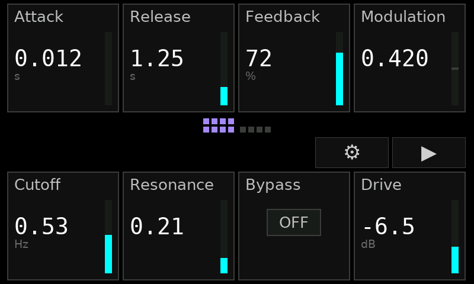
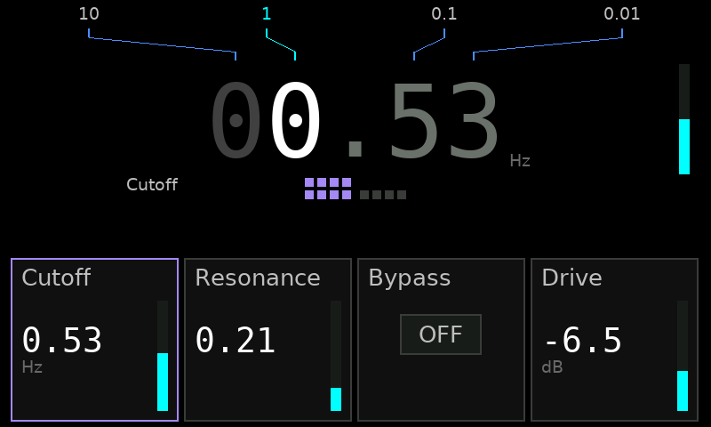
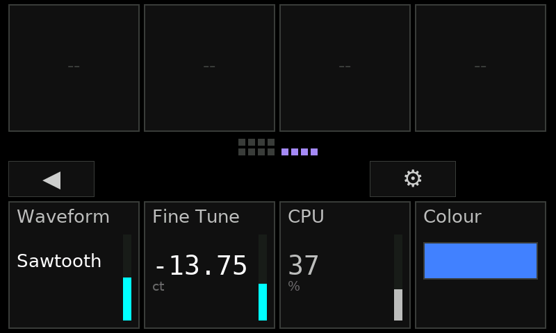
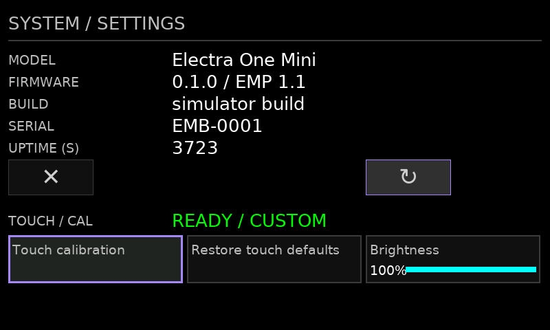
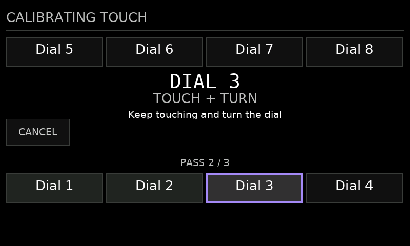

# electra-mini-fw

Open firmware and a reference platform for the **Electra One Mini** control surface
(Renesas Synergy S7G2, Cortex-M4F).

This repository contains the complete device-side stack: board bring-up, hardware drivers,
a recovery bootloader, USB update tools, the EMP/1 control-surface protocol, and a native UI
used with Kimchi and Chips' proprietary `av-frameworks` stack. It is also intended as a base
for firmware that keeps the proven hardware and update layers while replacing most or all of
the application.

> [!CAUTION]
> This replaces firmware in the Electra application region. Read [RECOVERY.md](RECOVERY.md)
> **before flashing anything**. Electra's stock bootloader remains untouched and is the final
> recovery path.



## What you get

- Complete bare-metal bring-up of the Electra One Mini: clocks, 100-pin mux, SDRAM,
  interrupt event links, display, inputs, capacitive touch, and USB.
- Two-image layout: a small recovery/update bootloader at `0x00100000` and a replaceable
  application at `0x00120000`.
- Driverless Windows application transport using vendor bulk USB and WinUSB; the recovery
  bootloader deliberately stays on CDC-ACM.
- USB application updates without opening the case, inserting an SD card, or pressing a
  hardware chord during the normal development loop.
- EMP/1, a bounded and allocation-free protocol for host-defined control surfaces.
- A hardware-free UI simulator and host test suite that compile the same application and
  protocol sources used on the device.
- Crash-loop protection, image validation, persistent health records, diagnostics, framebuffer
  capture, and a stock-bootloader recovery route.

## Control surface for `av-frameworks`

`av-frameworks` is Kimchi and Chips' in-house audiovisual framework stack. It is currently
private, with a view to making the full stack open source in the future. Its host-side provider
describes a surface over USB; this firmware owns the physical interaction, display, and device
lifecycle. The provider is not part of this repository, but the device contract is public and
specified in [docs/protocol.md](docs/protocol.md).

The integration currently provides:

- Up to **64 absolute control slots**, displayed as stable pages of **eight controls** matching
  the physical 2×4 knob layout. Sparse descriptors leave intentional holes rather than moving
  controls between pages.
- Host-defined labels, units, ranges, precision, steps, defaults, choice labels, current values,
  and read-only state.
- Numeric, choice, toggle, RGB/RGBA colour, and read-only presentation, including UTF-8
  transport and explicit diagnostics when device-side font or memory limits are reached.
- Low-latency local integration for bounded or stepped controls. Unbounded controls report
  deltas for the host to integrate.
- Precise numeric editing: press a knob to drill into its field, then use the opposite row of
  knobs as a four-place digit editor. Capacitive touch highlights the digit under the user's
  hand without making navigation depend on an imperfect continuous touch signal.
- Per-field undo, redo, and reset-to-default; stable paging; and host-requested page reveal.
- Transactional descriptor replacement. A failed or partial update never replaces the live
  surface, and session IDs make device resets visible to the host.
- Device and link diagnostics through EMP/1 heartbeats, counters, and structured diagnostic
  messages.

### UI tour

| Precise editing | More field types |
|---|---|
|  |  |
| Pressing a knob opens a focused value editor; the opposite row controls decimal places. | Choice labels, units, read-only values, colour swatches, sparse slots, and paging share one descriptor model. |

| Device-local settings | Touch calibration |
|---|---|
|  |  |
| Firmware identity, uptime, reboot, brightness, calibration, and restoring defaults do not require the host UI. | Calibration guides the operator through each selected dial and persists successful measurements. |

These are 800×480 renders from the host simulator. It compiles the real UI, state, font, and
surface-protocol sources against a framebuffer in place of the RA8876 display driver.

## Using this as a firmware platform

This repository is designed to be forked and adapted at source level. It is **not currently
packaged as an installed or independently linkable library**: CMake builds complete `bootloader`
and `app` images from explicit source sets. The subsystem boundaries nevertheless make it
possible to keep the difficult hardware and recovery work while replacing the product.

| Usually keep | Replace or adapt |
|---|---|
| `src/startup/` and `src/bsp/`: memory map, reset path, clocks, SDRAM, pin mux, ICU | `src/main.c`: application composition and service loop |
| `src/hal/`: display, USB, I²C, inputs, touch, flash-facing drivers | `src/app/`: UI, interaction state, history, calibration policy |
| `src/boot/` and persistence in `src/common/`: recovery, update handoff, image health | `src/proto/`: keep EMP/1 for `av-frameworks`, or replace it for another host |
| `cmake/`, image gates, simulator, deploy tools, and host tests | USB identity, product strings, capabilities, fonts, and application assets |

A practical custom application can therefore retain:

```text
startup/BSP → HAL → recovery bootloader and updater
                   ↘ your protocol → your state model → your UI
```

Keep the following invariants when changing the composition:

1. Preserve the image addresses, or update the linker scripts, boot handoff, validation tools,
   and recovery documentation together.
2. Bring up a diagnostic USB path before hardware that can hang, so a failed peripheral remains
   observable.
3. Do not remove the application health handshake until an equivalent crash-loop guard exists.
4. Keep the stock bootloader region at `0x00000000–0x000FFFFF` untouched.
5. Never stage `/boot/blupdate.srec`; see the recovery guide for why.

The hardware-specific evidence behind the platform is recorded in
[docs/hardware-notes.md](docs/hardware-notes.md), including corrections made after testing on
the physical unit.

## Build and test

### Prerequisites

- CMake 3.20 or newer and Ninja.
- Arm GNU Toolchain `arm-none-eabi` (the checked-in toolchain file is tested with 14.2).
- Node.js, used by the post-build S-record address and shape gate.
- For the Windows host tests and simulator: Visual Studio Build Tools with MSVC.
- For simulator PNG output and deployment tools: Python 3 with Pillow and pyserial.

The firmware itself builds with GCC; Renesas e² studio and SSP are not required for the normal
checked-in build.

```powershell
python -m pip install pillow pyserial

cmake -S . -B build -G Ninja `
  -DCMAKE_TOOLCHAIN_FILE=cmake/arm-none-eabi.cmake
cmake --build build
```

The build produces:

| Image | Address | Normal installation path |
|---|---:|---|
| `build/bootloader.srec` | `0x00100000` | SD-card route; normally installed once |
| `build/app.srec` | `0x00120000` | USB updater; replaced freely |

Run the protocol, descriptor, interaction, queue, and touch-calibration tests on the host:

```powershell
powershell -File tools/run-proto-tests.ps1
```

Render any built-in UI scene without hardware:

```powershell
powershell -File tools/sim/run-sim.ps1 ui
powershell -File tools/sim/run-sim.ps1 focus
powershell -File tools/sim/run-sim.ps1 page2
powershell -File tools/sim/run-sim.ps1 system
powershell -File tools/sim/run-sim.ps1 cal-active
```

Each invocation writes `build/sim/sim.png`. The available scenes are listed in
[`tools/sim/sim_main.c`](tools/sim/sim_main.c).

## Install and update

The first installation changes the layout of the Electra application region and must follow
[RECOVERY.md](RECOVERY.md). Once the project bootloader is installed, the normal application
loop is one command:

```powershell
python tools/deploy/flash_usb.py build/app.srec
```

The tool asks a running WinUSB application to enter its CDC recovery bootloader, erases and
writes the application slot, verifies it, and launches it. Useful related commands are:

```powershell
python tools/deploy/flash_usb.py --reboot
python tools/deploy/flash_usb.py --console
python tools/deploy/screenshot.py --out build/shot.png
```

The two firmware images intentionally enumerate differently:

| Image | USB transport | Host implementation |
|---|---|---|
| Application | Vendor bulk, automatically bound to WinUSB through MS OS 2.0 descriptors | `tools/deploy/winusb.py` |
| Recovery bootloader | CDC-ACM COM port | `tools/deploy/rawcom.py` |

Keeping recovery on the older, independent transport means a broken application descriptor or
WinUSB implementation cannot remove the update path.

## Repository map

| Path | Purpose |
|---|---|
| `src/startup/`, `src/bsp/` | Reset, memory layout, clocks, pins, SDRAM, interrupt routing |
| `src/hal/` | Display, USB, flash-facing, I²C, touch, and physical input drivers |
| `src/boot/`, `src/common/` | Recovery bootloader, handoff, console, persistent health and calibration |
| `src/proto/` | EMP/1 framing, session, diagnostics, queues, and surface state |
| `src/app/` | Control-surface UI, interaction state, history, fonts, calibration |
| `tools/` | Image validation, deployment, diagnostics, font generation, simulator |
| `tests/` | Host-compiled protocol and application-state tests |
| `docs/protocol.md` | Normative EMP/1 wire protocol |
| `docs/hardware-notes.md` | Hardware findings and on-device evidence |
| `RECOVERY.md` | Installation, recovery tiers, and unbricking procedure |

## Current status and limits

Milestones M0–M5 are complete and verified on hardware. The images boot independently, drive
the panel, read every input, speak EMP/1 over WinUSB, recover from application crashes, run the
native control-surface UI, and start without a computer attached. The private
`av-control-surface-electra-mini-fw` provider has reached `SurfaceLink::Live` against this
firmware with no provider errors.

Current device bounds are 64 slots and eight controls per page. EMP `FLOW`/credit enforcement,
bulk throughput and queue/window measurement, non-Latin font coverage, and the complete
shared-vector corpus remain open work documented in [docs/protocol.md](docs/protocol.md).

The application transport reduced measured small-request latency from 15–30 ms over CDC to
0.1–0.2 ms over WinUSB; descriptor acknowledgements fell from 14–29 ms to about 0.2 ms. These
figures were measured with `tools/deploy/emp.py` on the current hardware.

## Origin and licensing

The stock firmware was used only to establish hardware behavior and undocumented peripheral
requirements. No stock application code or source material is included here; relevant findings
were independently confirmed on the device and recorded in the hardware notes.

Original project code is available under the [MIT License](LICENSE).

The DejaVu fonts under `tools/font/vendor/`, and the generated glyph atlas in
`src/app/font_data.c`, remain covered by the bundled
[Bitstream Vera/DejaVu license](tools/font/vendor/LICENSE_DEJAVU). That license is separate from
the project's MIT license and must be retained when redistributing those assets.
